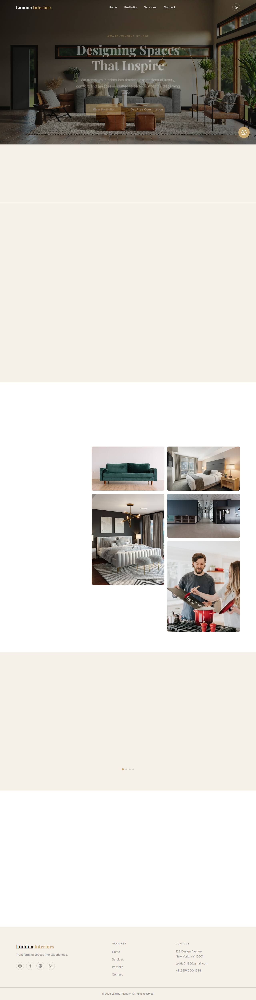

# Lumina Interiors

[](https://developer.mozilla.org/en-US/docs/Web/HTML)
[](https://developer.mozilla.org/en-US/docs/Web/CSS)
[](https://developer.mozilla.org/en-US/docs/Web/JavaScript)
[](https://formsubmit.co/)
[](#license)
[](https://teddy731684.github.io/Lumina/)

A luxury interior design studio landing page. No framework, no build step, no dependencies — pure HTML, CSS, and JavaScript.

🌐 **Live demo:** [https://teddy731684.github.io/Lumina/](https://teddy731684.github.io/Lumina/)



## About

Lumina Interiors is a fully responsive, single-page marketing site built for a high-end interior design studio. Every section is engineered for first impressions: an animated hero, filterable portfolio grid with a full-screen lightbox, scroll-triggered stats counter, testimonial carousel, and a contact form wired to FormSubmit for zero-backend lead capture.

The CSS variable system supports a complete **dark / light mode** with no flash on load. Theme preference is persisted in `localStorage` and applied via a blocking inline script before first paint — so dark mode users never see a white flicker. All colours live in one `:root` block; switching brand colours is a single-file edit.

## Features

### Theming & Design

* **Dark / light mode** — zero-FOUC toggle backed by `localStorage`; semantic CSS aliases (`--bg-primary`, `--text-primary`) are the only variables that change in dark mode, keeping the palette vars stable
* **CSS variable system** — all brand colours (`--color-gold`, `--color-black`, etc.) in one `:root` block; re-theming is a single-file edit
* **Scroll fade-in animations** — `IntersectionObserver` adds `visible` to any `.fade-in` element on entry; stagger delays injected inline by JS for service cards and stat items

### Portfolio

* **Filterable grid** — filter buttons show / hide items with a 400 ms opacity fade, then `display:none` to remove from layout
* **Full-screen lightbox** — keyboard navigable (`←` `→` `Esc`), scroll-locked (iOS Safari workaround via `position:fixed`), scrollbar-width compensated to prevent layout shift
* **Filter ↔ lightbox sync** — lightbox rebuilds its prev/next array at click time from currently visible items only, so navigation always reflects the active filter

### Engagement

* **Animated stats counter** — `data-target` / `data-suffix` driven, fires once on intersection (50% threshold), easeOutQuad easing over 2 seconds
* **Testimonial carousel** — 5-second auto-advance, pauses on hover and on `visibilitychange`, left/right swipe support (50 px threshold), dots generated by JS
* **Toast notifications** — `showToast(msg, type)` module-level utility, auto-dismisses at 4.5 s, available anywhere in `script.js`

### Lead Generation

* **Contact form** — posts JSON to [FormSubmit](https://formsubmit.co) with inline client-side validation; `_honey` and `_captcha` hidden fields for spam protection and AJAX mode
* **WhatsApp float button** — fixed floating CTA linking directly to WhatsApp chat
* **Back-to-top button** — appears after 400 px of scroll, smooth-scrolls to top

## Tech Stack

| Layer | Technology |
|-------|------------|
| **Markup** | HTML5 (semantic, ARIA-labelled) |
| **Styles** | CSS3 — custom properties, Grid, Flexbox, `@keyframes`, `backdrop-filter` |
| **Scripting** | Vanilla JavaScript ES2022 — `IntersectionObserver`, `fetch`, `requestAnimationFrame` |
| **Fonts** | Google Fonts — Playfair Display + Inter |
| **Form backend** | FormSubmit (AJAX mode, no server required) |
| **Dev server** | `npx serve` or VS Code Live Server |

## Architecture

```
┌─────────────────────────────────────────────────────┐
│                    index.html                       │
│  navbar → hero → stats → services → portfolio →    │
│  testimonials → contact → footer → lightbox →      │
│  floating elements (WhatsApp · back-to-top · toast) │
└──────────────┬──────────────────────────────────────┘
               │
┌──────────────▼──────────────────────────────────────┐
│                    style.css                        │
│  :root variables → reset → utilities → sections →  │
│  [data-theme="dark"] overrides → responsive →      │
│  @keyframes                                         │
└──────────────┬──────────────────────────────────────┘
               │
┌──────────────▼──────────────────────────────────────┐
│                    script.js                        │
│  DOMContentLoaded → initNavbar() · initThemeToggle()│
│  initScrollAnimations() · initStatsCounter()        │
│  initPortfolioFilter() · initLightbox()             │
│  initCarousel() · initForm() · initBackToTop()      │
└─────────────────────────────────────────────────────┘
```

## Development

Serve locally — `file://` breaks FormSubmit AJAX and CSS `background-attachment: fixed`:

```bash
npx serve .
```

Or use VS Code Live Server. Open `http://localhost:3000` (or the assigned port).

## License

Proprietary / All Rights Reserved.
